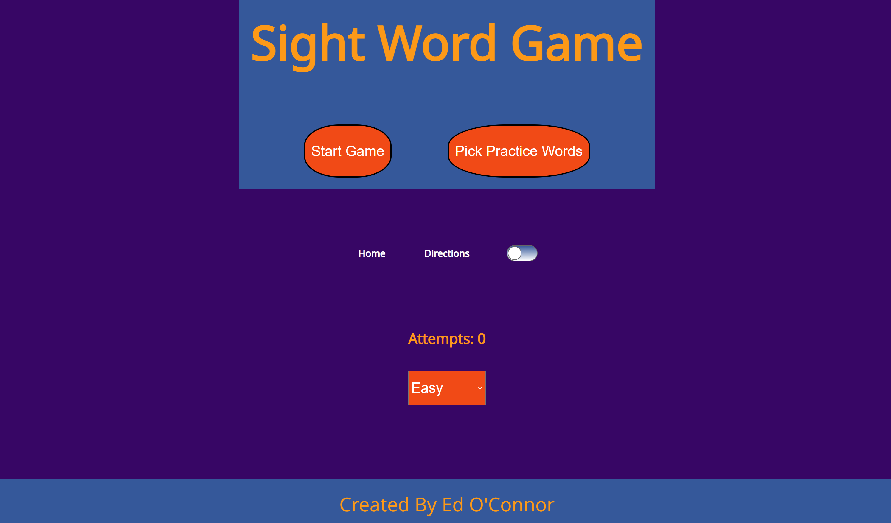
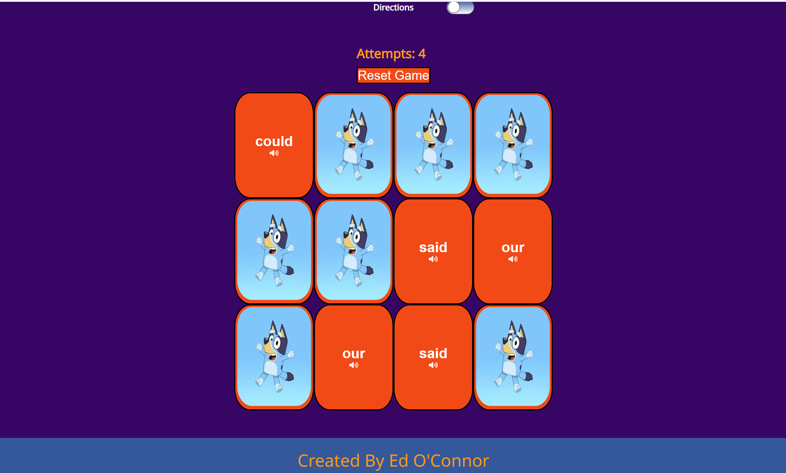
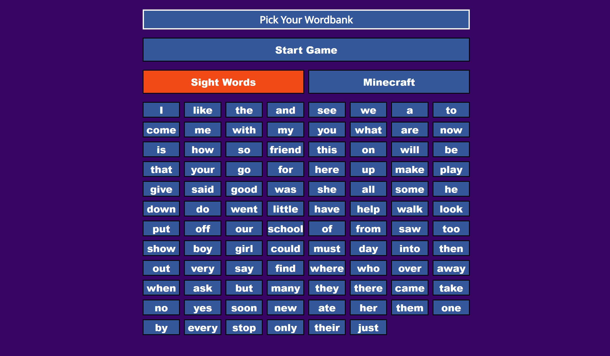
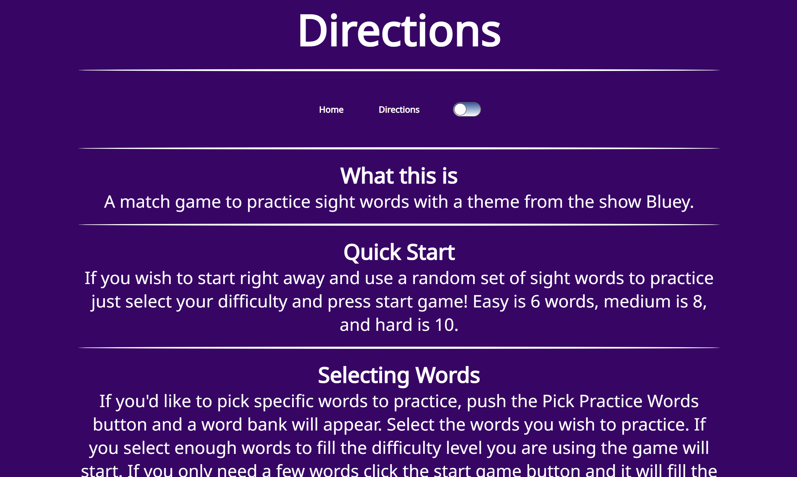

# Sight Words Game

Hi! - welcome to _Sight Words Game_!

This is a Bluey themed matching game I built for my daughter to help her with her sight words and help her to recongize and spell words from MineCraft.

## Home Page

## Game

## Word Bank

## Directions

### Tools used

_Sight Word Game_ is built with react.  I used hooks for most of the functionality and styled components for the css.

### How to get started

**First Clone the repo**

**yarn install**

**yarn start**

### Site hosted on netlify here 

[Sight Words Game](sight-words-game.netlify.app)